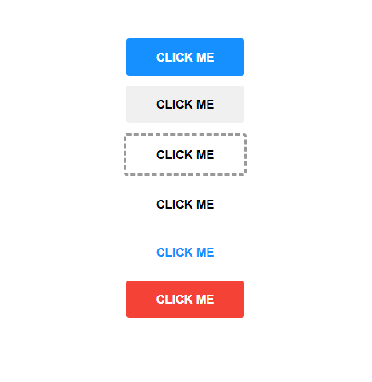

# buttoncomponentfs

> Made with create-react-library

[](https://www.npmjs.com/package/buttoncomponentfs) [](https://standardjs.com)

## Install

**If you are using @react17 or newer versions, try to install with --legacy-peer-deps**
```bash
npm install --save buttoncomponentfs --legacy-peer-deps
```

<div align="center">

</div>

## Usage

```jsx
import React from 'react'

import Button from 'buttoncomponentfs'
import 'buttoncomponentfs/dist/index.css'

class Example extends Button {
  render() {
    return (
      <Button text="click me" type="primary" />
      <Button text="click me" />
      <Button text="click me" type="dashed" />
      <Button text="click me" type="text" />
      <Button text="click me" type="link" />
      <Button text="click me" type="danger" />
    )
  }
}
```

## License

MIT © [frknsprnl](https://github.com/frknsprnl)
